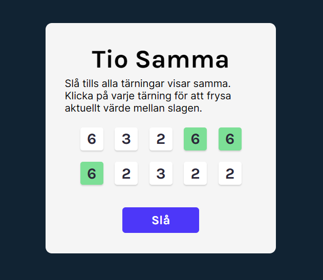

# Tenzies - a game with dice

## Description
Click the **Roll** button to get new numbers. Click the numbers you want to keep.

Roll until you get all dice the same!

When you accomplish this a great firework will appear on your screen!

 

 
 
 
NOTE! The same project, but WITHOUT TypeScript is found <a href="https://github.com/qserena/11-tenzies-sv/">Here!</a> 
 
 

## Technologies
- HTML
- CSS
- TypeScript
- React

## Live link
Tenzies is deployed here:
[https://tenzies-sv-ts.netlify.app](https://tenzies-sv-ts.netlify.app)

Please feel free to visit and try the game!

## What I learned
### Conditional styling

### Conditional rendering

### Keep track of certain condition
